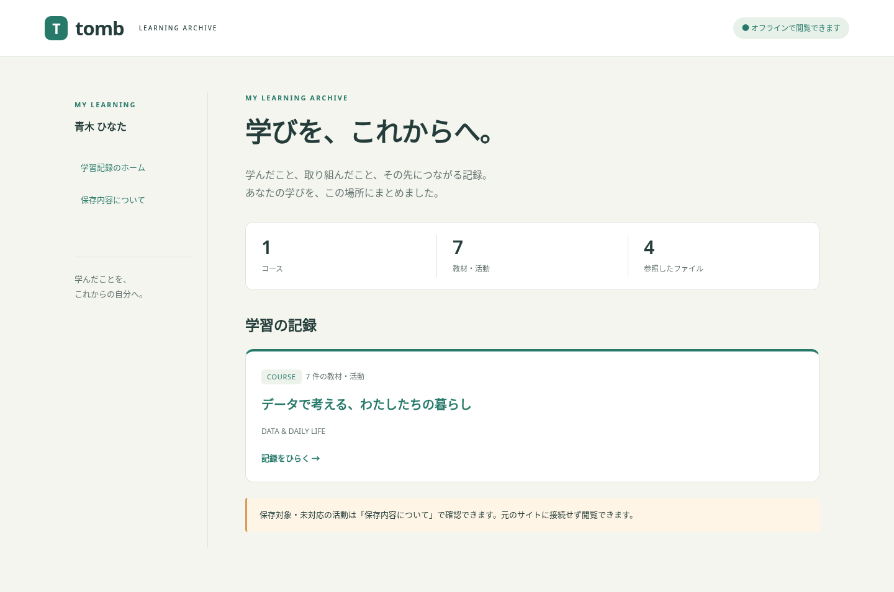

# Tomb — Moodle 学習記録アーカイブ

Moodle の教材と学習成果を、ZIP を展開して読む静的 HTML にまとめる `local_tomb` プラグインです。**0.3.0-alpha / PoC**。Moodle 5.0・PHP 8.4 の検証環境で動作確認しています。

生成物は `index.html` から閲覧できます。サーバー起動や Moodle へのログインは不要です。画面の JavaScript を無効にしても本文とリンクは使えます。数式表示には同梱の MathJax を使います。



[利用者の出力要求](docs/screenshots/0.3/08-learner-request.png)、[管理者の運用設定](docs/screenshots/0.3/09-administrator-controls.png)、[一括受付](docs/screenshots/0.3/10-administrator-batch-request.png)を含む [画面例と操作の流れ](docs/SCREENSHOTS.md)も掲載しています。

## できること

- 学生によるコース選択、非同期生成、ZIP 準備、Moodle 通知、認証付きダウンロード、受取確認。
- ファイル・フォルダ・ページ・ラベル、本人の課題本文と添付、公開済みの講評と添付、公開成績の保存。
- 閲覧可能なフォーラム投稿・返信・添付。グループ、公開期間、Q&A の可視性を反映し、他の投稿者を仮名で表示。
- 小テストの保存済み受験を、本人のレビュー権限に従って出力。多肢選択、○×、記述、数値、組み合わせの5形式を検証。受験中の記録と未対応形式は注記。
- 教師版の保存、学生版の作成代行、管理者によるコース単位の複数受付（1回20名まで）、版ごとの受領一覧・CSV・手動リマインド。
- 日本語・英語の画面と静的ページ。作成時の出力言語を版に固定し、教材本文は元の言語で保存。
- 履歴と受領管理のページ送り、コース・状態・受領状況の絞り込み、同じ条件でのCSV出力。
- 旧版の保持、新版とのページ増減・本文差分、保存対象の注記、manifest、監査記録の JSONL 出力。

教師版は仮名が標準です。実名には `local/tomb:exportothersdata` の明示付与と理由が必要です。教師版は採点・成績閲覧権限に従い、未公開の評価や講評も扱います。学生版は引き続き本人への公開内容に限定します。実名出力の権限を失った後は、完成済み実名版の取得も停止します。仮名化は氏名・投稿者欄が対象で、本文と元ファイル内の個人情報は書き換えません。

## 導入

1. このリポジトリの内容を Moodle の **`local/tomb/`** に置きます。
2. 既存プラグインに保留中の更新がないことを確認し、Moodle の CLI 実行ユーザーで以下を実行します。

   ```sh
   php local/tomb/cli/install.php
   php local/tomb/cli/install.php --install
   php local/tomb/cli/status.php
   ```

   専用インストーラは `local_tomb` だけを導入・更新します。Moodle 本体や別プラグインの更新、メンテナンスモードへの移行は行いません。別プラグインの版が不一致なら停止します。
3. 「サイト管理 → プラグイン → ローカルプラグイン → Tomb 設定」で対象コーホート・容量等を設定し、`/local/tomb/manage.php` で **検証モード**にします。
4. 対象学生が `/local/tomb/index.php` を開き、コースを選んで「記録を作成して受け取る」を押します。通常の Moodle cron が生成と ZIP 組立を順番に実行します。

新規導入時は無効です。本番・配信のみモードには未来の配送期限と設定確認が必要です。検証データと本番データは取得と集計で分離します。Moodle標準のPrivacy APIによる個人データ出力・承認済み削除に対応しています。0.1の保存材料が残る環境には移行ゲートがあり、不完全な個人データ応答を返しません。[個人データと旧版の移行](docs/PRIVACY.md)を参照してください。

詳しい設定、保持、障害時の対応は [運用手順](docs/OPERATIONS.md)、対応機能と未検証事項は [対応範囲](docs/FEATURES.md)を参照してください。

## 保存と配信の仕組み

収集時に、圧縮済み HTML と Moodle File API による元ファイルの参照、CRC、サイズ、配置順を固定します。ObjectFS に対応し、`filedir` の物理パスには依存しません。元ファイルは STORE、本文等は生成時に DEFLATE で圧縮します。

ダウンロード要求を受けてから、固定した材料を ZIP/Zip64 に組み立て、全エントリを検証して通知します。教師が代行した学生版は、本人が ZIP 準備を依頼するまで完成 ZIP を作りません。本人向けの作成ボタンは、収集と ZIP 準備をまとめて明示的に依頼する操作です。

同じ版のキャッシュ再構成は同じバイト列になります。収集中に削除が確認された元資料は、その参照とともに出力対象から外します。完成版の保存材料を失った場合は、その版の配信を止め、新しい版の作成を案内します。

見積CLIは既知の添付サイズと仮予算を区別します。提出物や投稿等の全サイズは収集前には未確定で、上限を保証しません。管理画面では処理時間・PHPプロセスのピークメモリ・保存量の実測を確認できます。

既定値は生成・組立の同時実行1件、ダウンロード1件、ZIP キャッシュ合計2 GiB・最長6時間です。ディスク空き容量は5 GiBまたは全体の10%の大きい方を確保します。材料は配送期限まで保持し、その後に管理者が明示的に削除します。

## 開発・検証

```sh
# Moodle や DB を使わない検証。
php tests/run.php --zip64

# 任意。ローカルの一時領域を使う実ファイル >4 GiB の検証。
php tests/run.php --large-file

# Moodle CLI。可視活動・既知の添付サイズ・仮予算を表示。要求や ZIP は作らない。
php local/tomb/cli/estimate.php --userid=USER_ID --courses=COURSE_ID
```

`cli/fixture.php` で専用の検証データ、`cli/demo.php --create` で別のデモコースを作成できます。`tests/` には、教材・権限・個人データ・競合・障害復旧・履歴・言語・容量の試験を同梱しています。Moodle上の試験は専用データと検証モードで明示実行し、共有DBの初期化は行いません。実行条件とコマンドは [運用手順](docs/OPERATIONS.md)を参照してください。

実画面は [スクリーンショット一覧](docs/SCREENSHOTS.md)、対応する機能と制限は [対応範囲](docs/FEATURES.md)で確認できます。

## アルファ版の境界

Windows・Safari の実機検証、実規模の負荷試験、Moodle 5.0 以外の検証は未実施です。全活動への対応、停止済みアカウントへの機関交付、詳細なルーブリック、日英以外の画面翻訳は今後の対象です。未対応活動や埋め込みは保存内容の注記に残します。添付資料は元の形式で保存します。

GPL v3 or later。[LICENSE](LICENSE)と [同梱ソフトウェア](docs/THIRD_PARTY.md)を参照してください。
