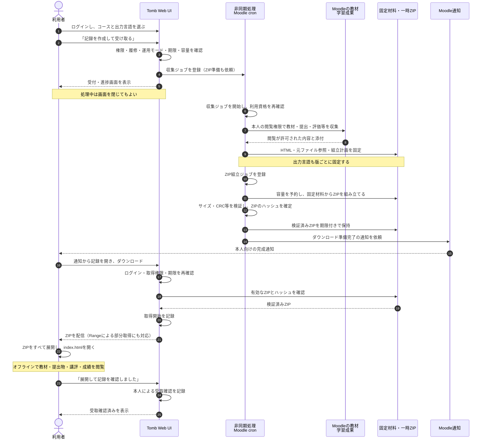
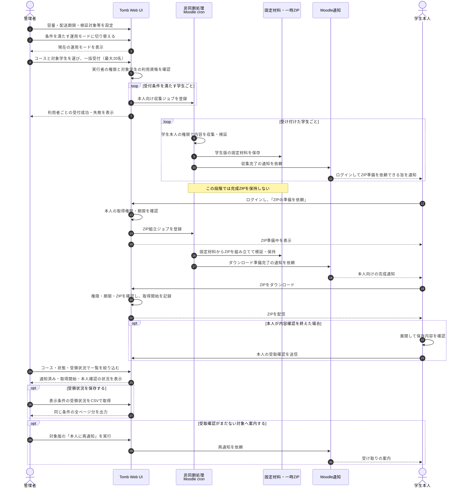
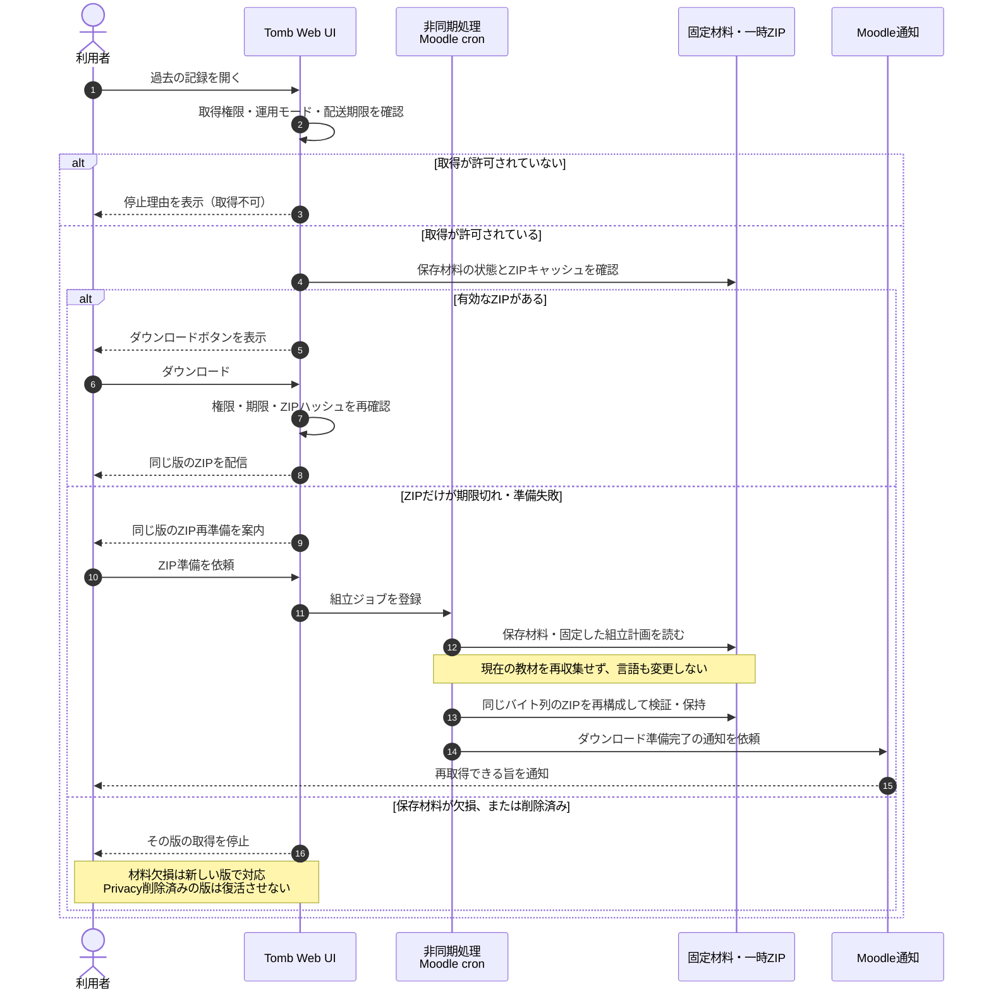

# 操作と処理の流れ

Tombは、Moodleの教材・学習成果を静的HTMLとして保存し、要求に応じてZIPを用意します。収集とZIP組立は通常のMoodle cronで非同期に実行します。利用者は処理中に画面を閉じても構いません。

以下は0.3.0-alphaの動作を表したMermaidのシーケンス図です。[画面例](SCREENSHOTS.md)と併せて確認できます。図1・2は正常に完了する場合を示し、待機・失敗時の扱いは末尾の表にまとめています。

## 1. 利用者が出力を要求し、記録を受け取る

「記録を作成して受け取る」は、収集とZIP準備をまとめて依頼する操作です。本人への通知は、ZIPの組立・検証が完了した後に届きます。

対応する画面：[出力要求](screenshots/0.3/08-learner-request.png)、[完成通知と取得](screenshots/0.3/05-download-and-notification.png)、[オフラインのホーム](screenshots/0.3/01-offline-home-ja.png)。

教師が自分の教師版を作成する場合も、収集から取得までの流れは同じです。収集対象は教師の採点・成績閲覧権限に従い、実名出力には追加権限と理由が必要です。

## 2. 管理者が学生版の作成を代行し、受領状況を確認する

管理者は運用設定を整え、コース単位で学生版を一括受付できます。代行ではまず収集を行い、学生本人がZIP準備を依頼するまで完成ZIPを作りません。

対応する画面：[運用モード](screenshots/0.3/09-administrator-controls.png)、[一括受付](screenshots/0.3/10-administrator-batch-request.png)、[未受領の管理](screenshots/0.3/07-receipt-management.png)。

教師も、権限のある担当コースで学生版の作成を代行できます。代行権限だけでは学生版を取得できません。Tomb管理権限を持つ管理者の取得は別途認可・監査され、学生本人の受取確認としては扱いません。

## 3. 同じ版を再取得する

完成ZIPは一時キャッシュです。キャッシュの期限が切れても、保存材料と取得資格が残っていれば、同じ版を再準備できます。キャッシュ期限と配送期限は別に判定します。

材料欠損が組立中に見つかった場合も、その版の配信を停止します。新しい版の作成は現在の利用資格・受付条件に従い、同じ版の再準備とは別の操作になります。

## 状態と通知の読み方

| 状態・記録 | 意味と次の操作 |
|---|---|
| 収集完了 | 静的ページと保存材料が確定した状態。ZIPが取得可能とは限らない。代行の場合は本人がZIP準備を依頼する |
| 容量待機 | ZIPの保存容量を確保できない状態。通常cronの清掃処理が待機中の組立を再受付する |
| 単一ZIPの上限超過 | 管理者による容量設定等の確認が必要。空き待ちだけでは解消しない |
| ZIP準備失敗 | 材料が残っていれば同じ版を再準備する。収集からのやり直しは不要 |
| 保存材料の欠損 | その版を配信停止にする。新しい版は現在の内容から生成する |
| Privacy削除・材料削除 | 削除された版は再取得できない。[個人データと移行](PRIVACY.md)を参照 |
| 配送期限終了 | 認証済みでも取得を停止する。材料の削除は別の明示操作 |
| 通知済み | 完成通知の送信を記録した状態。本人が読んだことや取得完了を示さない |
| 取得開始 | ZIP配信の開始を記録した状態。最後まで保存・展開できたことを示さない |
| 本人確認済み | 学生本人が展開・内容確認後に受取確認を送信した状態 |

通知はMoodleの通知機構を使います。既定ではサイト内通知が有効で、メール通知は設定に従います。詳細な設定と障害時の対応は [運用手順](OPERATIONS.md)を参照してください。
